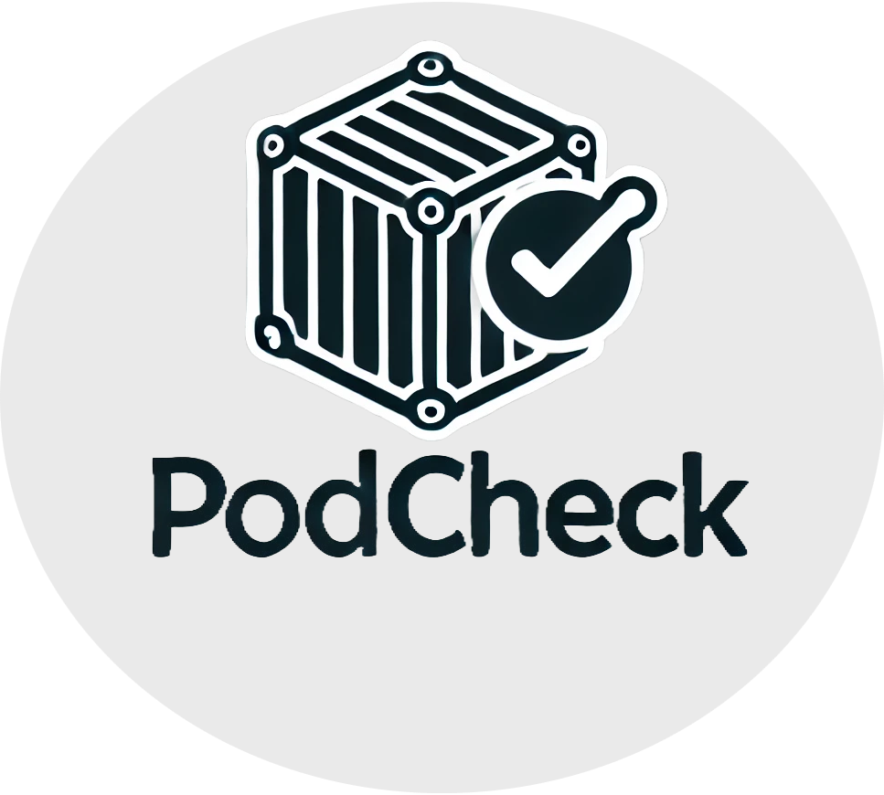

<div align="center">


### Podcheck

_A CLI tool to automate Podman image updates or notify when updates are available. Selective updates, exclude containers, custom labels, notification plugins, prune when done etc._
</div>

<div align="center">


[](https://scorecard.dev/viewer/?uri=github.com/sudo-kraken/podcheck)
</div>

## Contents

- [Overview](#overview)
- [Features](#features)
- [Breaking changes in v0.7.1](#breaking-changes-in-v071)
  - [What changed](#what-changed)
  - [Migration steps from-v061](#migration-steps-from-v061)
  - [New features](#new-features)
- [Changelog](#changelog)
- [`podcheck.sh` usage](#podchecksh)
  - [Basic example](#basic-example)
- [Dependencies](#dependencies)
- [Install instructions](#install-instructions)
  - [Quick install script only](#quick-install-script-only)
  - [Full install script--notification-system](#full-install-script--notification-system)
  - [Alternative git clone recommended-for-development](#alternative-git-clone-recommended-for-development)
- [Configuration](#configuration)
- [Notifications](#notifications)
  - [Configuration](#configuration-1)
  - [Snooze feature](#snooze-feature)
  - [Current notify templates](#current-notify-templates)
  - [Notification channel configuration](#notification-channel-configuration)
- [Release notes addon](#release-notes-addon)
- [Asynchronous update checks with xargs](#asynchronous-update-checks-with-xargs--x-n-option-default1)
- [Extra plugins and tools](#extra-plugins-and-tools)
  - [Using podchecksh with systemd units Quadlet](#using-podchecksh-with-systemd-units-quadlet)
  - [Prometheus and node_exporter](#prometheus-and-node_exporter)
- [Labels](#labels)
- [Workaround for non-amd64--arm64](#workaround-for-non-amd64--arm64)
- [Function to auth with Docker Hub before running](#function-to-auth-with-docker-hub-before-running)
- [`-r` flag disclaimer and warning](#-r-flag-disclaimer-and-warning)
- [Known issues](#known-issues)
- [Debugging](#debugging)
- [The story behind podcheck](#the-story-behind-podcheck)
- [Acknowledgements](#acknowledgements)
- [Licence](#licence)
- [Security](#security)
- [Contributing](#contributing)
- [Support](#support)

## Overview

podcheck automates checking and updating Podman images and compose stacks, or notifies you when updates are available. It supports selective updates, container exclusion, labels to control behaviour, a rich notification system and optional pruning when finished.

## Features

- Selective updates or notify-only operation
- Exclude containers, include stopped containers, respect labels
- Compose-aware with options to restart only a specific service or the whole stack
- Systemd Quadlet detection and restart
- Prometheus metrics export for node_exporter
- Self-update capability and optional async processing
- Rich notifications with multiple channels and snooze support

___
## BREAKING CHANGES IN v0.7.1

**If upgrading from v0.6.1 or earlier, please read this carefully!**

### What Changed
- **Notification system completely rewritten** - old `notify.sh` files will NOT work
- **Configuration file now required** for notifications - see `podcheck.config`
- **New notification template architecture** - all templates updated

### Migration Steps from v0.6.1
1. **Backup your old setup**: `cp notify.sh notify.sh.backup` (if you have one)
2. **Copy the new config**: `cp podcheck.config ~/.config/podcheck.config`
3. **Configure notifications**: Edit `~/.config/podcheck.config` with your credentials
4. **Enable channels**: Set `NOTIFY_CHANNELS="pushover telegram"` (or your preferred services)
5. **Test notifications**: Run `./podcheck.sh -i` to test
6. **Remove old files**: `rm notify.sh` (if you have one)

### New Features
All dockcheck v0.7.1 notification services are now supported with enhanced functionality.

___
## Changelog

- **v0.7.3**: 🐛 **Bug Fixes & CI Improvements**
    - **Fixed**: Self-update function ordering issue causing "command not found" error
    - **Fixed**: Moved `self_update()` and `self_update_curl()` functions before they are called
    - **Added**: Comprehensive CI workflows (ShellCheck, testing, release automation)
    - **Added**: Automated release workflow with SBOM generation and signing
    - **Added**: Renovate configuration for shell script dependency tracking
    - **Improved**: ShellCheck workflow to only fail on errors, not warnings
    - **Improved**: Test workflow to properly handle exit codes
- **v0.7.1**: 🚨 **BREAKING CHANGES**
    - **BREAKING**: Notification system completely rewritten - old notify.sh files incompatible
    - **BREAKING**: Configuration file now required for notifications (`podcheck.config`)
    - Added complete notification template parity with dockcheck v0.7.1
    - Added 13 notification services: pushover, telegram, ntfy, smtp, matrix, pushbullet, apprise, discord, gotify, slack, Home Assistant, Synology DSM, generic
    - Added support for multiple notifications using the same template
    - Added support for notification output format (text, json, csv)
    - Added support for file output
    - Added optional configuration variables per channel to (replace `<channel>` with any channel name):
      - `<channel>_TEMPLATE` : Specify a template
      - `<channel>_SKIPSNOOZE` : Skip snooze
      - `<channel>_CONTAINERSONLY` : Only notify for podman container related updates
      - `<channel>_ALLOWEMPTY` : Always send notifications, even when empty
      - `<channel>_OUTPUT` : Define output format
    - Added advanced configuration system with `podcheck.config`
    - Added new command line options: `-F`, `-I`, `-M`, `-u`, `-x`
    - Added async processing support with xargs
    - Enhanced notification system with `notify_v2.sh` wrapper
    - Added snooze functionality to prevent duplicate notifications
    - Improved dependency management with automatic downloads
    - Added helper functions: `releasenotes()`, `list_options()`, `progress_bar()`
    - **Fixed Quadlet container detection**: Restored v0.6.0 behavior of checking ALL containers for updates, including systemd-managed Quadlet containers
- **v0.6.0**:
    - **Grafana & Prometheus Integration:**  
      - Added a detailed Prometheus metrics exporter that now reports not only the number of containers with updates, no-updates, and errors, but also the total number of containers checked, the duration of the update check, and the epoch timestamp of the last check.
      - Enhanced documentation with instructions on integrating these metrics with Grafana for visual monitoring.
    - **Improved Error Handling & Code Refactoring:**  
      - Introduced `set -euo pipefail` and local variable scoping within functions to improve reliability and prevent unexpected behaviour.
      - Standardised container name handling and refined the Quadlet detection logic.
    - **Self-Update Enhancements:**  
      - Updated the self-update mechanism to support both Git-based and HTTP-based updates, with an automatic restart that preserves the original arguments.
    - **Miscellaneous Improvements:**  
      - Enhanced dependency installer to support both package manager and static binary installations for `jq` and `regctl`.
      - General code refactoring across the project for better readability and maintainability.

___
## `podcheck.sh`

```
$ ./podcheck.sh -h
Syntax:     podcheck.sh [OPTION] [comma separated names to include]
Example:    podcheck.sh -y -x 10 -d 10 -e nextcloud,heimdall

Options:
-a|y   Automatic updates, without interaction.
-c D   Exports metrics as prom file for the prometheus node_exporter. Provide the collector textfile directory.
-d N   Only update to new images that are N+ days old. Lists too recent with +prefix and age. 2xSlower.
-e X   Exclude containers, separated by comma.
-f     Force stop+start stack after update. Caution: restarts once for every updated container within stack.
-F     Only compose up the specific container, not the whole compose stack (useful for master-compose structure).
-h     Print this Help.
-i     Inform - send a preconfigured notification.
-I     Prints custom releasenote urls alongside each container with updates in CLI output (requires urls.list).
-l     Only update if label is set. See readme.
-m     Monochrome mode, no printf colour codes and hides progress bar.
-M     Prints custom releasenote urls as markdown (requires template support).
-n     No updates, only checking availability.
-p     Auto-Prune dangling images after update.
-r     Allow checking for updates/updating images for podman run containers. Won't update the container.
-s     Include stopped containers in the check. (Logic: podman ps -a).
-t N   Set a timeout (in seconds) per container for registry checkups, 10 is default.
-u     Allow automatic self updates - caution as this will pull new code and autorun it.
-v     Prints current version.
-x N   Set max asynchronous subprocesses, 1 default, 0 to disable, 32+ tested.
```

### Basic example

```
$ ./podcheck.sh
...
Containers on latest version:
filebrowser
foundryvtt

Containers with updates available:
1) joplin-db
2) it-tools

Choose what containers to update:
Enter number(s) separated by comma, [a] for all - [q] to quit:
```

Then it proceeds to run `podman pull` and `podman compose up -d`, or restarts systemd units for every container with updates.  
After the updates are complete, you will be prompted if you would like to prune dangling images.

___
## Dependencies

- Running **Podman** and **compose**, either standalone or plugin
- **Bash** 4.3 or newer  
  - POSIX `xargs` for async, usually present via `findutils`
- **jq** https://github.com/jqlang/jq  
  - You will be prompted to install via package manager or download a static binary
- **regclient/regctl** https://github.com/regclient/regclient  
  - You will be prompted to download `regctl` if not present in `PATH` or `PWD`  
  - `regctl` provides `amd64` and `arm64` binaries; see the workaround below for other architectures

## Install instructions

### Quick install (script only)

For basic container checking without notifications:

```sh
# Download and install main script
curl -L https://raw.githubusercontent.com/sudo-kraken/podcheck/main/podcheck.sh -o ~/.local/bin/podcheck.sh
chmod +x ~/.local/bin/podcheck.sh
```

### Full install (script + notification system)

For complete functionality with all notification services:

```sh
# Create podcheck directory
mkdir -p ~/.local/bin/podcheck/

# Download main script
curl -L https://raw.githubusercontent.com/sudo-kraken/podcheck/main/podcheck.sh -o ~/.local/bin/podcheck/podcheck.sh
chmod +x ~/.local/bin/podcheck/podcheck.sh

# Download notification templates and default config
cd ~/.local/bin/podcheck/
curl -L https://github.com/sudo-kraken/podcheck/archive/main.tar.gz | tar -xz --strip-components=1 podcheck-main/notify_templates
curl -L https://raw.githubusercontent.com/sudo-kraken/podcheck/main/podcheck.config -o podcheck.config

# Create symlink for easy access (optional)
ln -sf ~/.local/bin/podcheck/podcheck.sh ~/.local/bin/podcheck.sh
```

### Alternative: git clone (recommended for development)

```sh
# Clone the repository
git clone https://github.com/sudo-kraken/podcheck.git ~/.local/bin/podcheck
chmod +x ~/.local/bin/podcheck/podcheck.sh

# Create symlink for easy access
ln -sf ~/.local/bin/podcheck/podcheck.sh ~/.local/bin/podcheck.sh
```

Then call the script anywhere with just `podcheck.sh`.

## Configuration

For advanced features like notifications and custom settings, create a configuration file:

1. Copy the default configuration: `cp default.config podcheck.config`
2. Place it alongside the script or in `~/.config/`
3. Uncomment and modify the settings you want to customise

`podcheck.config` controls:

- Notification channels `NOTIFY_CHANNELS`
- Timeouts, async and update behaviour
- Notification templates and credentials

Without this file, podcheck runs with defaults and notifications are disabled.

Alternatively create an alias where specific flags and values are set, for example:

```sh
alias pc='podcheck.sh -p -x 10 -t 3'
```

## Notifications

Triggered with the `-i` flag. Sends a list of containers with updates and a note when `podcheck.sh` itself has an update.  
`notify_templates/notify_v2.sh` is the default notification wrapper. If `notify.sh` is present and configured, it will override.

Example cron job running non-interactive at 10 o’clock, excluding one container and sending notifications:

```
0 10 * * * /home/user123/.local/bin/podcheck.sh -nix 10 -e excluded_container1
```

#### Configuration

Edit `podcheck.config`:

- Set `NOTIFY_CHANNELS="pushover telegram"` for example
- Add required variables for each channel you enable, for example:

```bash
NOTIFY_CHANNELS="pushover telegram"
PUSHOVER_APPTOKEN="your_app_token"
PUSHOVER_USERKEY="your_user_key"
TELEGRAM_BOTTOKEN="bot_token"
TELEGRAM_CHATID="chat_id"
```

It is recommended to configure via `podcheck.config` and not edit `notify_templates/notify_*.sh` directly.  
To customise the wrapper, rename a modified `notify_v2.sh` to `notify.sh` in the podcheck root directory.

#### Snooze feature

Receive scheduled notifications only if they are new since the last notification within a set duration.

- Enable by setting `SNOOZE_SECONDS=<seconds>` in `podcheck.config`
- Snooze is split into: container updates, `podcheck.sh` self updates and notification template updates
- The effective snooze period is 60 seconds shorter than `SNOOZE_SECONDS` to allow for minor scheduling drift

#### Current notify templates

- Synology **DSM**
- Email via **mSMTP** or legacy **sSMTP**
- **Apprise** native or **linuxserver/docker-apprise-api**
- **ntfy**, **Gotify**, **Pushbullet**
- **Telegram**, **Matrix**, **Pushover**
- **Discord**, **Slack**
- **Home Assistant**, **Synology DSM**, **generic**

Further additions welcome via issues or PRs.

#### Notification channel configuration

All required environment variables per channel are listed as comments in `default.config`; uncomment and set them in `podcheck.config`.

Advanced toggles per channel, replace `<channel>` with the uppercase channel name in `NOTIFY_CHANNELS`:

- `<channel>_SKIPSNOOZE=true` to bypass snooze
- `<channel>_CONTAINERSONLY=true` to send only container updates
- `<channel>_ALLOWEMPTY=true` to always send notifications
- `<channel>_OUTPUT=text|json|csv` to choose output format
- `<channel>_TEMPLATE=<template>` to reuse a template for multiple channels, then set required vars with the `<channel>` prefix

## Release notes addon

Provide a lookup file to include release note URLs in notifications:

- Copy `notify_templates/urls.list` next to `podcheck.sh` and edit it; left column matches container names
- Show URLs in CLI output with `-I`
- Markdown formatting with `-M` if the template supports it

Example output:

```
Containers on hostname with updates available:
apprise-api  -> https://github.com/linuxserver/docker-apprise-api/releases
homer        -> https://github.com/bastienwirtz/homer/releases
nginx        -> https://github.com/docker-library/official-images/blob/master/library/nginx
```

## Asynchronous update checks with **xargs**; `-x N` option (default=1)

Pass `-x N` where `N` is the number of subprocesses. Experiment to find a suitable maximum.  
Set `MaxAsync=0` in `podcheck.sh` to disable subprocess usage entirely.

## Extra plugins and tools

### Using `podcheck.sh` with systemd units (Quadlet)

podcheck detects containers managed by systemd units and restarts them via `systemctl restart`.

### Prometheus and node_exporter

Export metrics via the node_exporter textfile collector:

```
podcheck.sh -c /path/to/exporter/directory
```

See the [addons/prometheus/README.md](./addons/prometheus/README.md) for detailed setup.

## Labels

Add optional labels to compose files:

```yaml
labels:
  sudo-kraken.podcheck.update: true
  sudo-kraken.podcheck.only-specific-container: true
  sudo-kraken.podcheck.restart-stack: true
```

- `sudo-kraken.podcheck.update: true` combined with `-l` updates only labelled containers
- `sudo-kraken.podcheck.only-specific-container: true` behaves like `-F`
- `sudo-kraken.podcheck.restart-stack: true` behaves like `-f` and restarts the entire stack

## Workaround for non **amd64** / **arm64**

If `regctl` is not available for your architecture, wrap the container image:

```sh
cat >regctl <<'EOF'
#!/bin/sh
opts=""
case "$*" in
  "registry login"*) opts="-t";;
esac
podman container run $opts -i --rm --net host \
  -u "$(id -u):$(id -g)" -e HOME -v $HOME:$HOME \
  -v /etc/docker/certs.d:/etc/docker/certs.d:ro \
  ghcr.io/regclient/regctl:latest "$@"
EOF
chmod 755 regctl
```

Place `regctl` alongside `podcheck.sh` or somewhere on your `PATH`.

## Function to auth with Docker Hub before running

Example wrapper:

```sh
function pchk {
  cat ~/pwd.txt | podman login --username YourUser --password-stdin docker.io
  ~/podcheck.sh "$@"
}
```

## `-r` flag disclaimer and warning

- Will **not** auto-update `podman run` containers, only their images  
- To use a new image with `podman run`, you must recreate the container  
- Safe to combine `-r` with `-i` and `-n` for notify-only checks

## Known issues

- No detailed error feedback for some edge cases
- Not respecting `--profile` when recreating containers
- Not working well with containers created by Portainer

## Debugging

- Run `extras/errorCheck.sh` for quick diagnostics
- Or run with bash tracing: `bash -x podcheck.sh`, optionally filter a single container: `bash -x podcheck.sh nginx`

## The story behind podcheck

Podcheck was created to bring the convenience of automated container updates to the Podman ecosystem. As a user of [Dockcheck](https://github.com/mag37/dockcheck) for Docker, the need for a similar tool for Podman became apparent. Podcheck aims to provide the same ease of use and automation, tailored for Podman users.

## Acknowledgements

Podcheck is inspired by the original [Dockcheck](https://github.com/mag37/dockcheck) script. Without Dockcheck, there would not have been a Podcheck. Many thanks to mag37 and all contributors to Dockcheck for their work and inspiration.

## Licence

podcheck is created and released under the [GNU GPL v3.0](https://www.gnu.org/licenses/gpl-3.0-standalone.html) licence.

## Security

If you discover a security issue, please review and follow the guidance in [SECURITY.md](SECURITY.md), or open a private security-focused issue with minimal details and request a secure contact channel.

## Contributing

Feel free to open issues or submit pull requests if you have suggestions or improvements.  
See [CONTRIBUTING.md](CONTRIBUTING.md)

## Support

Open an [issue](/../../issues) with as much detail as possible, including your environment, podman version and any relevant podcheck output.
